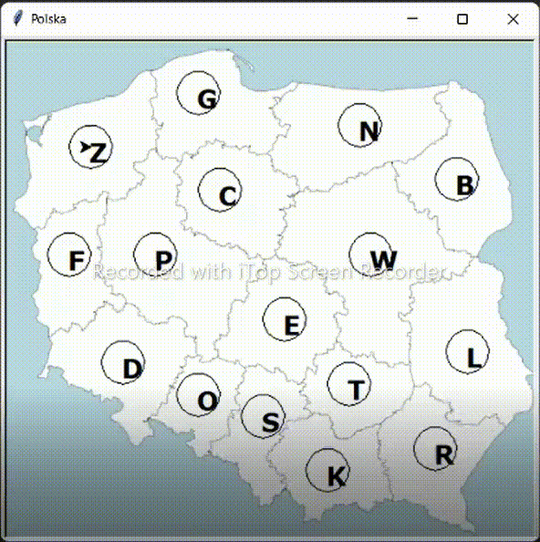

# MST-Visualisation
I modified one of my tasks in collegue course, added more funcionalites and created something like this. 
You can see how Kruskal and Prime method of Minimum spanning tree are working. Vertexes and edges represents Poland voivodeships and distance beetween them in km. 

Example results: 

